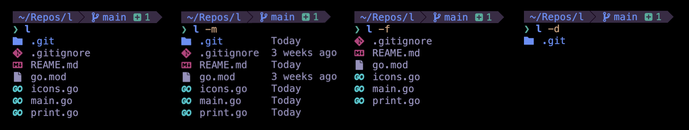

# l - list directory entries

`l` is like `ls` but simpler and graphically nicer.


## Install

```bash
go install github.com/devkvlt/l
```

## Usage

```bash
l path/to/directory
```

Or if you want to use the current directory as arg

```bash
l
```

Print directories only

```bash
l -d path/to/directory
```

Files only

```bash
l -f path/to/directory
```

Print last time entry was modified

```bash
l -m path/to/directory
```
